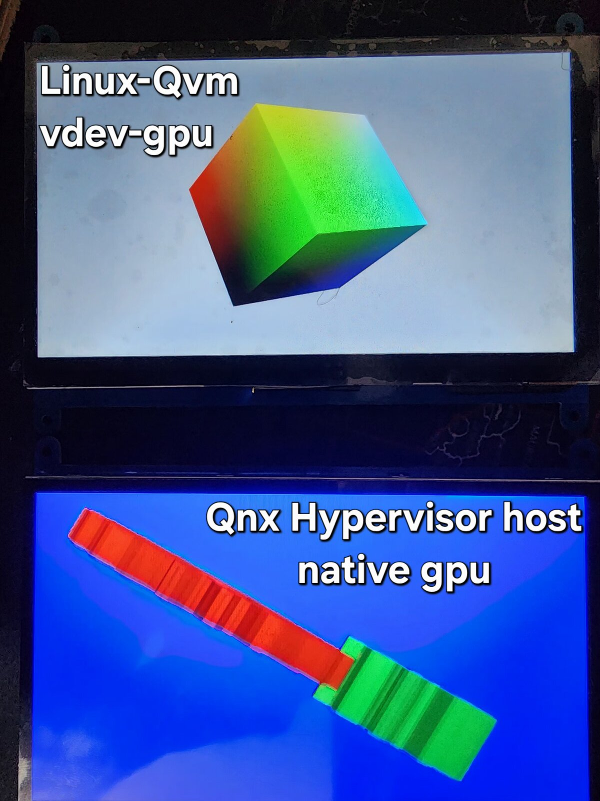

# QNX vdev-virtio-gpu

[](https://blackberry.qnx.com/)
[](https://docs.mesa3d.org/drivers/virgl.html)
[](https://www.raspberrypi.com/products/raspberry-pi-5/)
[](https://www.yoctoproject.org/)
[](LICENSE)

A **paravirtual GPU with virgl 3D** for the QNX 8.0 hypervisor (`qvm`) on the
Raspberry Pi 5. The QNX host owns the V3D and both HDMI outputs and renders its
own UI natively; a Linux guest gets a **virtio-gpu** device whose 3D commands are
executed by **virglrenderer on the same V3D** and scanned out to a second display.

No GPU passthrough: no identity-mapped guest RAM, no MMIO/IRQ pass-through, no
device-tree overlays. The guest uses plain `ram`; this backend maps guest memory
with `gasp_map()` and qvm auto-generates the virtio-gpu FDT node.

**Proven result:** QNX `gles2-gears` on one HDMI *while* the guest's `kmscube`
renders through virgl on the same GPU on the other HDMI, guest
`GL_RENDERER = virgl (V3D 7.1.7.0)`.



```
   Linux guest (Yocto)                    QNX host (owns V3D + both displays)
   ───────────────────                    ───────────────────────────────────
   kmscube / Qt6 (GLES)                   cluster UI / gles2-gears
     │ Mesa virgl gallium                   │ QNX Screen (native V3D: v3d_dri.so)
     ▼                                      ▼
   drm/virtio (mainline)               ┌─ Screen/WFD ── HDMI0 & HDMI1
     │ virtio-mmio (ctrlq)             │
     ▼                                 │
   ┌──────────────── qvm ─────────────┴───────────┐
   │ vdev-virtio-gpu.so  (this repo)              │
   │   render thread owns EGL context:            │
   │   virtio-gpu cmds ──► virglrenderer (ported) │
   │   scanout: Screen-client window + GPU        │
   │            readback + screen_post_window     │
   └──────────────────────────────────────────────┘
                       │ EGL/GLESv2 (Screen default display)
                       ▼
                 V3D 7.1 silicon
```

I **wrote** the qvm vdev backend. I **ported** virglrenderer + libepoxy
(cross-compiled for QNX aarch64le — external, see `paths.txt`). I **reuse
unchanged** the guest's mainline `drm/virtio` + Mesa virgl, QNX's `drm-rpi5`
Mesa/Screen stack, and qvm's `vio`/`vq` virtio transport helpers.

> **HDMI numbering.** The RPi5's two physical ports are `HDMI0`/`HDMI1`, but QNX
> Screen indexes displays **1-based**, so Screen "display 1" = the first HDMI and
> "display 2" = the second. The docs use the Screen numbering (`-display=2`,
> `scanout-display 1`); the diagram above labels the physical ports.

## Tested with

| Component | Version |
|---|---|
| Board | Raspberry Pi 5 (BCM2712, V3D 7.1) |
| Host | QNX SDP **8.0**, qvm hypervisor; `qcc -Vgcc_ntoaarch64le` |
| virglrenderer | **1.11.0**, base commit `f849f8e1` + `patches/virglrenderer-qnx.patch` |
| Guest OS | Yocto **scarthgap** + `meta-raspberrypi` (Linux/Mesa = layer defaults) |
| Guest GPU | mainline `drm/virtio` + Mesa `virgl` gallium; `GL_RENDERER = virgl (V3D 7.1.7.0)` |

## Repo layout

```
vdev-virtio-gpu.c        the backend (command dispatch + render thread)
virtio_gpu.h             virtio-gpu protocol structs/enums used by the vdev
edid_build.inc           pure EDID synthesizer (built from the live Screen mode)
edid_selftest.c          host self-check for edid_build.inc (cc -DEDID_SELFTEST)
Makefile                 builds vdev-virtio-gpu.so (qcc, aarch64le)
paths.txt.example        external paths template -> copy to paths.txt
build-image.sh           builds vdev + guest + assembles a flashable disk.img
example/
  host/
    guest.qvmconf        minimal qvm config: one virtio-gpu vdev -> HDMI1
    start-demo.sh        host autostart: gears on screen 2, guest on screen 1
  guest/meta-guest/      minimal Yocto layer: kernel + mesa(virgl) + kmscube
```

## How the backend works

- **Transport.** qvm's `vio.h`/`vq.h` implement the whole virtio-mmio register
  file and virtqueues; the vdev is command dispatch only. It links **`-lhypS`**
  for the `vq_*` helpers statically (like QNX's own vdevs); `vio_*`/`gasp_*`/
  `vdev_register_factory` stay undefined and bind to qvm at load.
- **Render thread.** virglrenderer and its EGL context are thread-affine, so all
  virgl calls run on one dedicated render thread that owns the context. It runs
  at **priority 8** — a hot loop at qvm priority once starved the whole host,
  including the UART, so the code never busy-spins. Init order: retry
  `screen_create_context()` for up to 60 s (**never touch EGL before it
  succeeds** — libkhronos `exit()`s the whole qvm process if Screen is down),
  then `virgl_renderer_init(USE_EGL|USE_SURFACELESS|USE_GLES)`.
- **Commands.** 2D (`GET_DISPLAY_INFO`, `GET_EDID`, `RESOURCE_CREATE_2D`,
  `ATTACH_BACKING` → `gasp_map` guest pages into iovecs → `resource_attach_iov`,
  `TRANSFER_TO_HOST_2D`, `SET_SCANOUT`, `RESOURCE_FLUSH`) and 3D
  (`CTX_*`, `RESOURCE_CREATE_3D`, `TRANSFER_TO/FROM_HOST_3D`, `SUBMIT_3D` →
  `virgl_renderer_submit_cmd`, `GET_CAPSET*`). Advertises `VIRTIO_GPU_F_VIRGL`
  and `VIRTIO_GPU_F_EDID`.
- **Display mode + EDID (dynamic).** On the render thread, once Screen is up, the
  vdev reads the target display's **live** mode (`SCREEN_PROPERTY_MODE` →
  `width`/`height`/`refresh`) and treats it as the source of truth. `GET_EDID`
  then synthesizes a 128-byte EDID from that mode (`edid_build.inc`), so the guest
  learns the panel's real resolution **and refresh** — the only virtio-gpu channel
  that carries refresh. Swap in a higher-Hz panel (edit `graphics.conf`), and the
  guest picks it up with **no vdev rebuild**. `scanout-width`/`scanout-height`,
  if given, still override the queried size.
- **Fences** (two hard rules):
  1. The response **must echo `VIRTIO_GPU_FLAG_FENCE` + `fence_id`** — the spec
     requires it; without it the guest's dma-fences never signal and the
     pipeline freezes after ~1 frame.
  2. `fence_wait` = `virgl_renderer_poll()` + `usleep(1000)` per iteration, 2 s
     hard cap. No busy-spin, ever.
- **Scanout** (`present_scanout`): a **QNX Screen client window** on the target
  display — not raw WFD, since Screen owns both display pipelines. Per presented
  flush: `resource_get_info` → `transfer_read_iov` **directly into the current
  Screen render buffer** (GPU readback) → `screen_post_window`. The window is
  **double-buffered** with `SWAP_INTERVAL = 1`, so the post blocks to vblank and
  the two buffers alternate (the old single-buffer strobe came from posting a
  never-filled 2nd buffer; here every frame is read back into the buffer that is
  then posted). Only flushes whose `resource_id == current scanout` present. A
  `SHM_LEN` register intercept (0x0b0/0x0b4 → `~0`) keeps the guest probe from
  failing `-EBUSY` (no blob/host-visible regions).
- **Pacing (vsync, refresh-agnostic).** No fixed software timer. The vsync'd
  double-buffered post *is* the governor: the serial ctrlq makes the guest queue
  behind it, so the guest locks to the panel's real refresh — 60 on a 60 Hz
  screen, 120 on a 120 Hz screen — with no code change. A `1e6/refresh`
  anti-runaway floor (derived from the live mode) only guards against a burst
  spinning the readback. This is what fixes apps that were stuck at 30 fps on a
  60 Hz panel.
- **Options** (in the qvmconf `vdev virtio-gpu` block): `scanout-width` /
  `scanout-height` (**optional overrides**; unset = auto-detect from the live
  Screen mode), `scanout-display` (1-based Screen display; unset = last; `-1` =
  headless diagnostic — render everything, never touch Screen).

## Build

All out-of-repo locations live in `paths.txt` (one `KEY=value` per line, read by
both the Makefile and `build-image.sh`). Start from the template:

```sh
cp paths.txt.example paths.txt   # then edit the paths for your machine
```

| Key | What it is |
|---|---|
| `QNX_SDP_ENV` | QNX SDP env script (qcc + mkifs/mkqnx6fsimg/…) |
| `VIRGL` | virglrenderer checkout with its `build-qnx/` — QNX-ported per `patches/` |
| `STAGE` | QNX virgl stage dir (libscreen etc.) |
| `YOCTO_POKY` / `YOCTO_BUILD` | poky dir + a build dir using `meta-guest` |
| `HYP_DIR` / `BSP_INSTALL` | QNX host build tree + BSP install (for the IFS) |

**Just the vdev:**

```sh
source $QNX_SDP_ENV
make                 # -> vdev-virtio-gpu.so (aarch64le)
```

**The whole flashable SD image** (vdev + guest image + host IFS + partitions):

```sh
./build-image.sh     # -> build/disk.img + build/disk.bmap
# SKIP_GUEST=1 ./build-image.sh   # reuse an already-built guest image
```

`build-image.sh` builds the two things this repo owns from source (the vdev and
the guest image), stages them into the QNX host tree, and drives its Makefile to
produce `disk.img`. The host IFS and the RPi firmware come from `HYP_DIR` /
`BSP_INSTALL` — rebuilding *those* is the QNX BSP's job, out of scope here.

`guest.qvmconf` is part of that host tree too: it must already live at
`$HYP_DIR/guests/linux-guest/guest.qvmconf` (the reference copy is
[`example/host/guest.qvmconf`](example/host/guest.qvmconf)). `build-image.sh` stages
only the guest `Image` + `rootfs.cpio.gz`, not the qvmconf.

The `VIRGL` checkout must be the **QNX-ported** virglrenderer. That port is not
vendored here (it is a separate upstream project) but is fully captured as
`patches/virglrenderer-qnx.patch` — see [`patches/README.md`](patches/README.md)
for the base commit, how to apply it, and the QNX cross-build recipe.

Flash:

```sh
sudo dd if=build/disk.img of=/dev/sdX bs=4M conv=fsync status=progress && sync
```

Use `dd` (full write), not `bmaptool`: a bmap reflash of a reused card can leave
stale qnx6fs metadata and corrupt the `/data` partition.

## Run

On the QNX host (serial or SSH):

```sh
sh /proc/boot/graphics_start.sh                 # bring up QNX Screen -> /dev/screen
gles2-gears -display=2 &                         # host GPU on HDMI2 (screen 2)
qvm @/guests/linux-guest/guest.qvmconf \         # guest on HDMI1 (screen 1)
    >/guests/linux-guest/guest-console.log 2>&1 &
```

Screen **must** be up before qvm (the vdev gates EGL on `screen_create_context`).
The image's autostart does all of this for you at boot.

Fast iteration without reflashing: the vdev honors `LD_LIBRARY_PATH`, so
`scp` a dev `.so` to `/tmp` and `slay qvm && LD_LIBRARY_PATH=/tmp qvm @…`.
Guest-only files (`Image`, `rootfs.cpio.gz`, qvmconf) live in the data partition
and can be `scp`'d straight to `/guests/linux-guest/`; only IFS changes need a
reflash.

## Troubleshooting

| Symptom | Cause | Fix |
|---|---|---|
| whole qvm process exits at startup, no error | an EGL call ran before Screen was up — libkhronos `exit()`s the process | start Screen (`graphics_start.sh` → `/dev/screen`) **before** `qvm`; the vdev already retries `screen_create_context()` for 60 s |
| host UART / whole system goes unresponsive | render thread busy-spun at qvm priority | never busy-spin; the render thread runs at priority 8 and the fence wait `usleep`s — don't reintroduce a hot loop |
| guest virtio-gpu probe fails `-EBUSY`, no `/dev/dri/card0` | guest read the shared-mem length register and got a real value | keep the `SHM_LEN` register intercept (`0x0b0/0x0b4 → ~0`) — no blob/host-visible regions are supported |
| guest renders ~1 frame then freezes | response didn't echo `VIRTIO_GPU_FLAG_FENCE` + `fence_id`, so guest dma-fences never signal | echo the fence flag **and** id on every fenced response (hard rule #1) |
| `SIGSEGV` inside `eglInitialize` | both `libdrm.so.1` (virgl) and `.so.2` (v3d_dri) loaded → wrong bind | `patchelf --replace-needed libdrm.so.1 libdrm.so.2` on `libvirglrenderer` (see `patches/README.md`) |
| black / no output on the guest's HDMI | wrong `scanout-display`, or a `scanout-width`/`scanout-height` override that doesn't match the panel | unset the size overrides to auto-detect the live Screen mode; check the 1-based `scanout-display` |
| guest won't go above 60 Hz on a high-refresh panel | `graphics.conf` `video-mode` still `@ 60`, so the live Screen mode (and the synthesized EDID) is 60 Hz | set the host `video-mode = W x H @ R` to the panel's rate; the vdev reads it at runtime — no rebuild. Confirm in-guest with `edid-decode /sys/class/drm/card0-*/edid` |
| `/data` partition corrupt after reflash | bmap reflash left stale qnx6fs metadata on a reused card | full-write with `dd` (`conv=fsync`), not `bmaptool` |

## The example

The [`example/`](example/README.md) dir holds the full two-screen demo — the host
qvm config + autostart ([`example/host/`](example/host/)) and the guest Yocto
layer ([`example/guest/meta-guest/`](example/guest/meta-guest/)). See
[`example/README.md`](example/README.md) for the wiring diagram and per-file notes.

The guest layer is a minimal Yocto layer (scarthgap) with only what kmscube needs:

- `recipes-kernel/linux` — virtio-mmio + `CONFIG_DRM_VIRTIO_GPU` + PL011 console.
- `recipes-graphics/mesa` — adds the `virgl` gallium driver.
- `recipes-core/kmscube` — `kmscube-autostart` (sysvinit S99, runlevel 5).
- `recipes-core/images/guest-image.bb` — a `cpio.gz` initramfs.

Build it into `YOCTO_BUILD` (`bitbake guest-image`); `build-image.sh` does this
and bakes the result into the data partition.


## Deliberate simplifications (upgrade paths)

- Scanout is a GPU readback + CPU post per frame; zero-copy would export the
  virgl resource as a dmabuf and import it into Screen (this is the throughput
  ceiling if a frame's render + readback ever exceed one vblank interval).
- Fences are synchronous (guest waits GPU completion in-line); async fences
  (`VIRGL_RENDERER_ASYNC_FENCE_CB`) would pipeline.
- Single scanout, no cursor queue, no `resource_blob`. The synthesized EDID caps
  its detailed-timing pixel clock at 655.35 MHz (e.g. blocks 4K@120).

## License

MIT — see [`LICENSE`](LICENSE). The vendored virglrenderer port is a separate
upstream project under its own license (captured as a patch, not vendored here).
